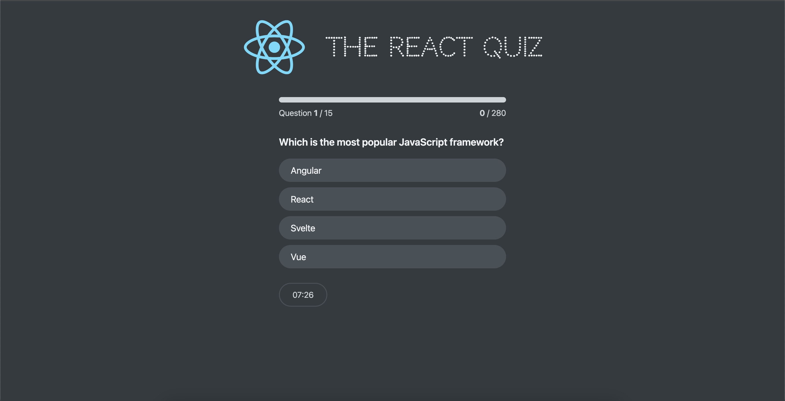
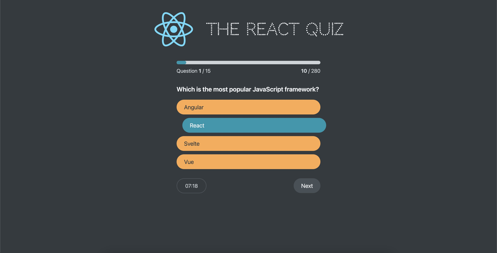

# React + TypeScript + Vite + useReducer

# React Quiz App

This is a React application built with Vite that serves a quiz and fetches questions from a JSON server.

1. npm run dev
2. npm run server - load data from src/data/questions.json

## Table of Contents

-   [Features](#features)
-   [Installation](#installation)
-   [Usage](#usage)

## Features

-   Displays quiz questions fetched from a JSON server
-   Supports multiple choice questions
-   Keeps track of the user's score
-   Responsive design for mobile and desktop

## Installation

1. Clone the repository:
    ```bash
    git clone https://github.com/yourusername/react-quiz-app.git
    ```
2. Navigate to the project directory:
    ```bash
    cd react-quiz-app
    ```
3. Install the dependencies:
    ```bash
    npm install
    ```

## Usage

1. Start the JSON server:

    ```bash
    npm run server
    ```

    This will start the JSON server and watch the `src/data/questions.json` file on port 9000.

2. Start the development server:
    ```bash
    npm run dev
    ```
    Open your browser and go to `http://localhost:5173` to see the app in action.

;

;
